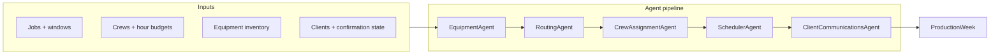

# Multi-agent production planner — architecture

## Problem

Window cleaning and similar field-service businesses run on **production weeks**: dense schedules where dispatchers must balance equipment, geography, job difficulty, crew skills, hour budgets, and—critically—**client confirmation and rescheduling**. One change (weather, a declined SMS, a lift rental slipping) ripples across the whole week.

## Design principle: specialists + orchestrator

Instead of one monolithic “AI scheduler,” **production-agent** uses a pipeline of narrow agents. Each agent owns one slice of the problem and publishes structured results the next agent consumes—similar to how a lead dispatcher, route planner, and office admin hand off work.



## Agents

| Agent | Responsibility | Key outputs |
|-------|----------------|-------------|
| **EquipmentAgent** | Feasibility vs inventory (poles, lifts, tanks) | Per-job feasible flag, shortage warnings |
| **RoutingAgent** | Geographic clustering, drive-time estimates | Clusters, proximity graph |
| **CrewAssignmentAgent** | Skill fit, difficulty, gear on truck, **weekly hour budget** | Job → crew matches with scores |
| **SchedulerAgent** | Day/time blocks, travel between stops | `ScheduledBlock[]` |
| **ClientCommunicationsAgent** | Confirmations, reschedules, hold-until-confirmed | `ClientAction` messages |

The **ProductionWeekPlanner** orchestrator runs agents in dependency order and merges outputs into a single `ProductionWeek` artifact.

## Rescheduling and confirmations (first-class)

- Jobs carry `confirmationStatus` and `status` separate from scheduling.
- `rescheduleJobIds` on `PlanningContext` forces the comms agent to propose new times instead of dispatching.
- Any newly proposed block for a non-confirmed job is added to `holdUntilConfirmed`—crews should not roll until the client confirms.

This mirrors real operations: **schedule optimistically, execute only what is confirmed.**

## Extension points

1. **LLM layer** — Replace or augment heuristics in each agent with tool-calling models (e.g. “explain why crew Bravo cannot take Summit Tower”).
2. **Human-in-the-loop** — Dispatcher approves `ProductionWeek`, triggers SMS/email webhooks from `ClientAction`.
3. **Data layer** — Supabase/Postgres for jobs, crews, equipment, confirmation audit log.
4. **Re-plan loop** — On `reschedule_requested` or `declined`, re-run pipeline with updated constraints only for affected cluster.
5. **Integration** — Jobber, ServiceTitan, Google Calendar, Twilio.

## Repository layout

```
src/
  domain/       # Types, geo helpers
  agents/       # One file per specialist
  orchestrator/ # ProductionWeekPlanner
  data/         # Sample week for demo
  index.ts      # CLI demo
```
